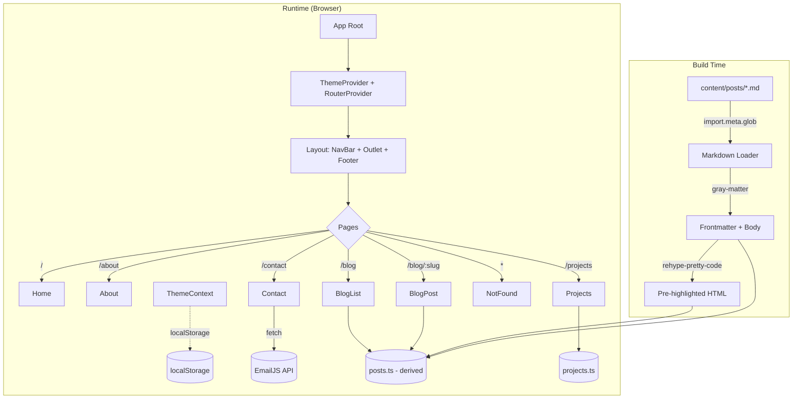

# Design Document

## Overview

本设计文档描述个人作品集与博客网站（Portfolio_Site）的技术架构与实现方案。站点由 React 18 + TypeScript + Vite 构建，使用 Tailwind CSS 实现玻璃拟态（Glassmorphism）视觉体系，通过 React Router v6 管理路由，使用 Context API 管理主题，博客文章以本地 Markdown 文件为数据源、构建时静态加载，联系表单通过 EmailJS 直接从前端提交。

设计目标：

- 在不引入后端的前提下交付一个功能完整、可部署到静态主机（Vercel / Netlify / GitHub Pages）的站点。
- 通过代码分割、懒加载、骨架屏满足首屏 ≤3000ms（4G 模拟）的性能目标。
- 保持视觉一致（玻璃拟态）、主题可切换（浅/深色）、响应式（320px–1920px）、可访问（WCAG 2.1 AA）。
- 将纯逻辑模块（Markdown 解析、过滤、排序、校验、主题持久化）从 UI 组件中剥离，便于属性化测试（PBT）。

### 关键设计决策

| 决策点 | 选择 | 理由 |
|---|---|---|
| 构建工具 | Vite | 支持 `import.meta.glob` 原生加载 Markdown、启动快、配置简洁 |
| 路由 | React Router v6 | 生态成熟，`lazy` API 与 `Suspense` 配合实现路由级代码分割 |
| 样式 | Tailwind CSS + CSS 变量 | Utility-first 与玻璃拟态风格契合；CSS 变量承载主题 token |
| 状态管理 | React Context + hooks | 需求状态局限（主题、筛选、搜索），Context 足矣，无需 Redux/Zustand |
| 动画 | Framer Motion | 内置 `useReducedMotion`，声明式 API，满足 prefers-reduced-motion 要求 |
| 博客渲染 | react-markdown + remark/rehype 插件 | 社区主流，插件生态可加 GFM、slug、TOC、语法高亮 |
| 语法高亮 | rehype-pretty-code（基于 Shiki） | 构建时生成高亮 HTML，运行时零成本，主题与站点深浅色对齐 |
| 表单提交 | EmailJS | 纯前端集成，零后端成本，支持 200 封/月免费额度 |
| 校验 | 纯函数层 + 表单状态 hook | 便于 PBT 针对 RFC 5322 邮箱等规则做属性测试 |

## Architecture

### 顶层架构



### 目录结构

```
/
├── index.html
├── package.json
├── tsconfig.json
├── tailwind.config.ts
├── vite.config.ts
├── public/
│   ├── favicon.svg
│   └── resume.pdf              # 可选：简历下载
└── src/
    ├── main.tsx                # 入口：挂载 React 根
    ├── App.tsx                 # 路由表 + Provider 组合
    ├── router.tsx              # createBrowserRouter 配置 + lazy 导入
    ├── types/
    │   ├── blog.ts             # BlogPost、BlogFrontmatter 类型
    │   ├── project.ts          # Project 类型
    │   └── theme.ts            # Theme 类型
    ├── content/
    │   └── posts/
    │       ├── 2024-01-hello.md
    │       └── ...
    ├── data/
    │   ├── posts.ts            # 构建时聚合所有 md 文件的导出
    │   ├── projects.ts         # 项目静态数据
    │   └── author.ts           # 作者信息（姓名、社交链接、技能、经历）
    ├── lib/                    # 纯逻辑层（PBT 主要目标）
    │   ├── markdown.ts         # frontmatter 解析、slug 规范化
    │   ├── filter.ts           # 项目标签过滤、博客标签过滤
    │   ├── search.ts           # 博客标题搜索
    │   ├── sort.ts             # 博客按日期倒序
    │   ├── paginate.ts         # 分页计算
    │   ├── validation.ts       # 邮箱、非空校验
    │   ├── readingTime.ts      # 阅读时长估算
    │   └── theme.ts            # 主题解析：localStorage + prefers-color-scheme
    ├── theme/
    │   ├── ThemeContext.tsx    # Context 定义 + Provider
    │   └── useTheme.ts         # Hook
    ├── hooks/
    │   ├── useScrollSpy.ts     # TOC 当前小节高亮
    │   ├── useInView.ts        # 滚动进入动画
    │   └── useReducedMotion.ts # 封装 framer-motion 的 hook
    ├── components/
    │   ├── layout/
    │   │   ├── NavBar.tsx
    │   │   ├── MobileMenu.tsx
    │   │   ├── Footer.tsx
    │   │   ├── Layout.tsx      # NavBar + <Outlet/> + Footer
    │   │   └── GradientBackground.tsx
    │   ├── glass/
    │   │   ├── GlassCard.tsx   # 玻璃拟态容器基础组件
    │   │   ├── GlassButton.tsx
    │   │   └── GlassInput.tsx
    │   ├── ui/
    │   │   ├── ThemeToggle.tsx
    │   │   ├── Skeleton.tsx
    │   │   ├── TagPill.tsx
    │   │   ├── TagFilter.tsx
    │   │   ├── SearchBox.tsx
    │   │   ├── Pagination.tsx
    │   │   └── PageTransition.tsx
    │   ├── project/
    │   │   └── ProjectCard.tsx
    │   ├── blog/
    │   │   ├── BlogCard.tsx
    │   │   ├── PostHeader.tsx
    │   │   ├── TableOfContents.tsx
    │   │   └── PrevNextNav.tsx
    │   └── contact/
    │       ├── ContactForm.tsx
    │       └── SocialLinks.tsx
    ├── pages/
    │   ├── Home.tsx
    │   ├── About.tsx
    │   ├── Projects.tsx
    │   ├── BlogList.tsx
    │   ├── BlogPost.tsx
    │   ├── Contact.tsx
    │   └── NotFound.tsx
    └── styles/
        └── globals.css         # @tailwind 指令 + CSS 变量定义 + 自定义 utility
```

### 路由架构

使用 React Router v6 `createBrowserRouter` 声明式定义路由，非首屏路由通过 `React.lazy` 实现代码分割。

```tsx
// src/router.tsx
import { createBrowserRouter } from "react-router-dom";
import { lazy } from "react";
import Layout from "./components/layout/Layout";
import Home from "./pages/Home"; // 首屏不 lazy

const About = lazy(() => import("./pages/About"));
const Projects = lazy(() => import("./pages/Projects"));
const BlogList = lazy(() => import("./pages/BlogList"));
const BlogPost = lazy(() => import("./pages/BlogPost"));
const Contact = lazy(() => import("./pages/Contact"));
const NotFound = lazy(() => import("./pages/NotFound"));

export const router = createBrowserRouter([
  {
    element: <Layout />,
    children: [
      { path: "/", element: <Home /> },
      { path: "/about", element: <About /> },
      { path: "/projects", element: <Projects /> },
      { path: "/blog", element: <BlogList /> },
      { path: "/blog/:slug", element: <BlogPost /> },
      { path: "/contact", element: <Contact /> },
      { path: "*", element: <NotFound /> },
    ],
  },
]);
```

`Layout` 组件负责渲染 `GradientBackground`、`NavBar`、`<Outlet />`、`Footer`，并用 `PageTransition` 包裹 `<Outlet />` 实现路由级淡入过渡（200–400ms，复合 prefers-reduced-motion 检查）。

### 样式系统与玻璃拟态

#### CSS 变量驱动主题

`src/styles/globals.css` 中基于 `html.light` 和 `html.dark` 两个类定义两套 token：

```css
:root, html.light {
  --bg-from: #fce7f3;        /* 渐变起点 */
  --bg-to:   #dbeafe;        /* 渐变终点 */
  --glass-bg: 255 255 255;   /* RGB triplet，供 rgb(var(--glass-bg) / <alpha>) 使用 */
  --glass-border: 255 255 255;
  --text-primary: #0f172a;
  --text-secondary: #475569;
  --accent: #7c3aed;
}

html.dark {
  --bg-from: #0f172a;
  --bg-to:   #1e1b4b;
  --glass-bg: 15 23 42;
  --glass-border: 255 255 255;
  --text-primary: #f1f5f9;
  --text-secondary: #94a3b8;
  --accent: #a78bfa;
}

/* 全局 300ms 颜色过渡，仅在非 reduced-motion 下生效 */
@media (prefers-reduced-motion: no-preference) {
  * {
    transition-property: background-color, border-color, color, fill, stroke;
    transition-duration: 300ms;
  }
}
```

#### Tailwind 自定义 utility：`.glass`

在 `tailwind.config.ts` 中通过 `addComponents` 注册 `.glass`：

```ts
// tailwind.config.ts (片段)
plugins: [
  plugin(({ addComponents }) => {
    addComponents({
      ".glass": {
        backgroundColor: "rgb(var(--glass-bg) / 0.18)",
        backdropFilter: "blur(14px)",
        WebkitBackdropFilter: "blur(14px)",
        border: "1px solid rgb(var(--glass-border) / 0.25)",
        boxShadow: "0 8px 32px 0 rgba(0, 0, 0, 0.12)",
        borderRadius: "1rem",
      },
      ".glass-strong": { /* 更高透明度版本，用于 NavBar */ },
    });
  }),
];
```

所有玻璃拟态容器通过 `<GlassCard>` 组件或 `className="glass ..."` 应用。该设计满足 Requirement 1 的全部透明度、模糊半径、边框宽度、阴影扩散范围约束（参数集中配置，便于后续调整）。

#### 渐变背景层

`GradientBackground` 组件以 `fixed inset-0 -z-10 bg-gradient-to-br from-[var(--bg-from)] to-[var(--bg-to)]` 渲染，承载玻璃拟态底色（Requirement 1.4）。

#### 响应式断点

Tailwind 默认断点已覆盖需求：`md: 768px`、`lg: 1024px`。以此实现三档布局切换（Requirement 2.1–2.3）。

## Components and Interfaces

### 布局组件

#### `Layout`
- 职责：组合 `GradientBackground` + `NavBar` + `<Outlet />`（被 `PageTransition` 包裹，内部 Suspense fallback 为全屏骨架）+ `Footer`。
- 使用语义化标签：`<header>`（NavBar）、`<main>`（Outlet）、`<footer>`（Requirement 13.5）。

#### `NavBar`
- Props：无（内部通过 `useLocation` 判断当前路由高亮）。
- 桌面布局渲染完整链接条；视口 <768px 时折叠为汉堡按钮，点击展开 `MobileMenu`。
- 当前路由链接应用 `aria-current="page"`（Requirement 13.6）与视觉高亮（下划线 + 主色）（Requirement 4.4）。
- 使用 `glass-strong`，通过 `sticky top-0 z-50` 保持顶部可见（Requirement 4.6）。
- 包含 `<ThemeToggle>`。

#### `Footer`
- 渲染版权 `© {new Date().getFullYear()} {author.name}`、社交图标链接。
- 应用 `.glass` 样式（Requirement 11.3）。

### 玻璃拟态原子组件

#### `GlassCard`
```tsx
interface GlassCardProps {
  as?: keyof JSX.IntrinsicElements;   // 默认 "div"
  variant?: "default" | "strong";
  className?: string;
  children: React.ReactNode;
}
```
- 封装 `.glass` / `.glass-strong` 以及统一的 `rounded-2xl p-6` 默认值。
- 所有卡片类组件（ProjectCard、BlogCard、联系表单容器、About 区块容器）通过 `GlassCard` 复用。

#### `GlassButton`, `GlassInput`
- 同样封装玻璃拟态样式，提供统一的 focus ring（Requirement 13.1）、aria-label passthrough、禁用状态。

### 主题相关

#### `ThemeContext`
```ts
type Theme = "light" | "dark";
interface ThemeContextValue {
  theme: Theme;
  toggleTheme: () => void;
  setTheme: (t: Theme) => void;
}
```
- Provider 初始化顺序（Requirement 3.2、3.6、3.7）：
  1. 读 `localStorage.getItem("theme")`；
  2. 若值为 `"light"` 或 `"dark"` 使用之；
  3. 否则读 `window.matchMedia("(prefers-color-scheme: dark)").matches`；
  4. 写入 `document.documentElement.classList`。
- `toggleTheme` 切换后同步 localStorage 与 `<html>` class。
- 为避免首屏闪烁（FOUC），在 `index.html` 的 `<head>` 内联一小段脚本，先于 React 挂载前应用主题 class：

```html
<script>
  (function() {
    try {
      var s = localStorage.getItem('theme');
      var m = window.matchMedia('(prefers-color-scheme: dark)').matches;
      var t = (s === 'light' || s === 'dark') ? s : (m ? 'dark' : 'light');
      document.documentElement.classList.add(t);
    } catch (e) {}
  })();
</script>
```

#### `ThemeToggle`
- 渲染一个图标按钮（太阳/月亮），`aria-label="Toggle theme"`（Requirement 13.4）、`aria-pressed={theme === "dark"}`。

### 页面组件

#### `Home`
- 渲染 `HeroSection` + `FeaturedProjects`（最多 3 个卡片，取 `projects.slice(0, 3)`）+ `LatestPosts`（最多 3 篇，取排序后 `posts.slice(0, 3)`）。
- Hero 两个 CTA：主按钮 "View Projects" → `/projects`；次按钮 "Get in Touch" → `/contact`（Requirement 5.3 实现决策）。
- Hero 容器桌面布局 `min-h-[80vh]`，满足 70–100% 视口高度约束（Requirement 5.1）。

#### `About`
- 使用静态 `author.ts` 数据渲染：头像（`` 带 alt）、姓名、身份 tag、自我介绍段落、`SkillsSection`（图标 + 技术名网格）、`TimelineSection`（竖向时间线，按时间倒序）。
- `WHERE author.resumeUrl 存在`：渲染 `<a href={resumeUrl} download>` 按钮（Requirement 6.5）。

#### `Projects`
- 顶部 `TagFilter`（多选或单选均可，设计取单选 + "All"）。
- 列表通过 `filterProjectsByTag(projects, selectedTag)`（`lib/filter.ts` 的纯函数）计算。
- 空结果时渲染 `<EmptyState text="No projects match this tag." />`（Requirement 7.7）。
- 网格：`grid grid-cols-1 md:grid-cols-2 lg:grid-cols-3 gap-6`（Requirement 2.7）。

#### `ProjectCard`
- `<GlassCard>` 内渲染封面（``）、标题、描述、标签、链接按钮。
- 悬停态：`hover:shadow-2xl hover:scale-[1.02] transition duration-300`（Requirement 7.4），在 reduced-motion 下禁用 `scale`。

#### `BlogList`
- 并列渲染 `<SearchBox>`（按标题前端过滤）、`<TagFilter>`。
- Pipeline：`posts → sortByDateDesc → filterByTag → filterByTitleQuery → paginate(page, perPage=6)`。
- 网格：`grid grid-cols-1 lg:grid-cols-2 gap-6`（Requirement 2.8）。
- 分页 `<Pagination>` 基于总数 > `perPage` 条件性渲染（Requirement 8.5）。

#### `BlogPost`
- `useParams` 获取 `slug`；通过 `getPostBySlug(slug)` 查询。
- 未找到：渲染 `<NotFoundPost>`，包含返回 `/blog` 的链接（Requirement 9.7）。
- 存在：渲染 `<PostHeader>` + 两栏布局（`lg:grid-cols-[1fr_240px]`），主列为 `<article>` 带 `<ReactMarkdown>` 渲染的正文；侧栏为 `<TableOfContents>`（桌面 sticky，移动端置顶收纳）。
- `react-markdown` 配置 `remark-gfm`、`rehype-slug`（为每个标题生成 id）、`rehype-pretty-code`（构建时语法高亮）。
- `<TableOfContents>` 通过 `useScrollSpy` hook 根据 IntersectionObserver 计算当前活动标题并添加 `aria-current` 与视觉高亮（Requirement 9.4、9.5）。
- `<PrevNextNav>` 根据按日期排序后的索引计算前/后文章（Requirement 9.6）。

#### `Contact`
- 渲染 `<ContactForm>` + `<SocialLinks>`。

#### `ContactForm`
- 使用受控组件；表单状态 `{ name, email, subject, message, errors, status: "idle" | "submitting" | "success" | "error" }`。
- 提交前调用 `validateContactForm(values)`（纯函数，返回 `errors` 对象）。
- 校验通过后：`status = "submitting"`，`GlassButton` 禁用（Requirement 10.7），调用 `emailjs.send(serviceId, templateId, values, publicKey)`。
- 成功：清空字段、`status = "success"` 并渲染提示。
- 失败：`status = "error"`，允许重试。
- 每个字段旁的错误文本使用 `aria-describedby` 关联，提升屏幕阅读器友好度。

#### `NotFound`
- 渲染 404 提示 + 返回首页按钮（Requirement 4.5）。

### Hook 接口

```ts
// useScrollSpy 追踪当前视口内的标题 id
function useScrollSpy(ids: string[], options?: { rootMargin?: string }): string | null;

// useInView 基于 IntersectionObserver 返回元素是否在视口内
function useInView<T extends Element>(options?: IntersectionObserverInit): [React.RefObject<T>, boolean];

// useReducedMotion 读取用户 OS 偏好，用于条件性禁用动画
function useReducedMotion(): boolean;
```

## Data Models

### TypeScript 类型定义

```ts
// src/types/theme.ts
export type Theme = "light" | "dark";

// src/types/project.ts
export interface ProjectLink {
  label: string;          // e.g. "Live Demo" / "GitHub"
  href: string;           // 绝对 URL
}

export interface Project {
  id: string;             // kebab-case 唯一标识
  name: string;
  description: string;    // 简短描述（建议 ≤160 字符）
  cover: string;          // 图片 URL 或 public/ 下路径
  tags: string[];         // 技术标签，如 ["react", "typescript"]
  links: ProjectLink[];   // 可为空数组
  featured?: boolean;     // 首页精选项目使用
  order?: number;         // 自定义排序
}

// src/types/blog.ts
export interface BlogFrontmatter {
  title: string;
  date: string;           // ISO 8601 (YYYY-MM-DD 或更精确)
  tags: string[];
  summary: string;        // 摘要（列表页用）
  author?: string;
  cover?: string;
}

export interface BlogPost {
  slug: string;                 // 从文件名派生，kebab-case
  frontmatter: BlogFrontmatter;
  contentHtml: string;          // 构建时预渲染的 HTML（含语法高亮）
  contentRaw: string;           // 原始 Markdown 正文，用于二次处理
  readingTimeMinutes: number;   // 由 readingTime.ts 计算
  toc: TocItem[];               // 构建时提取的标题树
}

export interface TocItem {
  id: string;       // 标题 slug
  text: string;
  depth: 2 | 3;     // 仅收录 h2/h3
}

// src/types/author.ts
export interface SocialLink {
  platform: "github" | "linkedin" | "twitter" | "email" | string;
  href: string;
  label: string;    // 用于 aria-label
}

export interface Skill {
  name: string;
  icon?: string;    // 图标名或 URL
  category?: string;
}

export interface TimelineItem {
  start: string;    // ISO date
  end: string | "present";
  title: string;
  org: string;
  description?: string;
}

export interface Author {
  name: string;
  headline: string;       // Hero 一句话身份
  bio: string;            // About 页自我介绍
  avatar: string;
  resumeUrl?: string;
  social: SocialLink[];
  skills: Skill[];
  timeline: TimelineItem[];
}
```

### 数据加载流程

#### 项目数据（`src/data/projects.ts`）

```ts
import type { Project } from "../types/project";

export const projects: Project[] = [
  { id: "demo-1", name: "...", description: "...", cover: "...", tags: [...], links: [...] },
  // ...
];
```

纯静态 TypeScript 导出；构建时被 Vite 打入 bundle。

#### 博客数据（`src/data/posts.ts`）

利用 Vite 的 `import.meta.glob` 在构建时加载所有 `src/content/posts/*.md`：

```ts
import matter from "gray-matter";
import { parseFrontmatter, slugFromFilename } from "../lib/markdown";
import { calculateReadingTime } from "../lib/readingTime";
import { sortByDateDesc } from "../lib/sort";

// eager + as: "raw" 让 Vite 内联所有 md 为字符串
const raw = import.meta.glob("../content/posts/*.md", { as: "raw", eager: true }) as Record<string, string>;

export const posts: BlogPost[] = sortByDateDesc(
  Object.entries(raw).map(([path, source]) => {
    const { data, content } = matter(source);
    const frontmatter = parseFrontmatter(data); // 校验并类型收窄
    const slug = slugFromFilename(path);
    // contentHtml/toc 通过 rehype 管道在 build-time vite plugin 中生成，
    // 这里对小型站点采用运行时渲染：BlogPost 页面按需 import react-markdown
    // 也可选择构建期插件预渲染，两种方案均满足需求 9
    return {
      slug,
      frontmatter,
      contentRaw: content,
      contentHtml: "",           // 运行时由 react-markdown 渲染
      readingTimeMinutes: calculateReadingTime(content),
      toc: [],                   // 运行时提取；见下
    };
  })
);

export const getPostBySlug = (slug: string): BlogPost | undefined =>
  posts.find((p) => p.slug === slug);
```

> 设计取运行时 markdown 渲染方案以保持工程简洁。语法高亮使用 `rehype-pretty-code` 的 client 模式或切换到 `shiki` 的懒加载 worker 模式。若后续性能有需求可升级为构建期预渲染。

#### 作者数据（`src/data/author.ts`）

静态 TS 模块；`author.name`、`author.timeline` 等供 About 与 Footer 复用。

### 纯逻辑函数签名（PBT 目标）

```ts
// src/lib/validation.ts
export function isNonEmpty(s: string): boolean;           // 去除首尾空白后长度 > 0
export function isValidEmail(s: string): boolean;         // RFC 5322 简化子集
export interface ContactFormValues { name: string; email: string; subject: string; message: string; }
export interface ContactFormErrors  { name?: string; email?: string; message?: string; }
export function validateContactForm(v: ContactFormValues): ContactFormErrors;

// src/lib/filter.ts
export function filterProjectsByTag(projects: Project[], tag: string | null): Project[];
export function filterPostsByTag(posts: BlogPost[], tag: string | null): BlogPost[];

// src/lib/search.ts
export function searchPostsByTitle(posts: BlogPost[], query: string): BlogPost[]; // case-insensitive substring

// src/lib/sort.ts
export function sortByDateDesc<T extends { frontmatter: { date: string } }>(items: T[]): T[];

// src/lib/paginate.ts
export interface Page<T> { items: T[]; page: number; totalPages: number; total: number; }
export function paginate<T>(items: T[], page: number, perPage: number): Page<T>;

// src/lib/theme.ts
export function resolveInitialTheme(
  stored: string | null,
  prefersDark: boolean
): Theme;

// src/lib/markdown.ts
export function slugFromFilename(path: string): string;            // kebab-case，无 .md 后缀
export function parseFrontmatter(raw: unknown): BlogFrontmatter;   // 缺字段抛错
export function extractToc(markdown: string): TocItem[];           // 仅 h2/h3
export function slugifyHeading(text: string): string;              // 生成标题 id

// src/lib/readingTime.ts
export function calculateReadingTime(markdown: string, wpm?: number): number; // 分钟，向上取整
```

这些纯函数是后续 PBT 的主要目标。


## Correctness Properties

*A property is a characteristic or behavior that should hold true across all valid executions of a system—essentially, a formal statement about what the system should do. Properties serve as the bridge between human-readable specifications and machine-verifiable correctness guarantees.*

本站点以前端展示为主，但其中包含若干核心纯逻辑函数（主题解析、过滤、搜索、排序、分页、校验、TOC 提取、slug 查找）以及若干具有普适性的渲染不变量（卡片必须包含对象全部可视字段、所有图片均需 alt 与 lazy、仅一个链接具 aria-current）。这些都是 PBT 的理想目标：随机输入能有效暴露边界 bug（超长字符串、仅空白字符、重复标签、空数组、大小写敏感、分页边界、日期相等等）。对纯 CSS/配置类、视口布局、路由行为、第三方库行为等则使用 snapshot、组件单测或 Playwright 集成测试。

### Property 1: 主题初始化解析的分支完备性

*For any* 可能的 `stored` 值（`null`、`"light"`、`"dark"`、任意其他字符串）以及任意 `prefersDark: boolean`，`resolveInitialTheme(stored, prefersDark)` 的返回值 SHALL 满足：若 `stored === "light"` 返回 `"light"`；若 `stored === "dark"` 返回 `"dark"`；其他情形返回 `prefersDark ? "dark" : "light"`。

**Validates: Requirements 3.2, 3.6, 3.7**

### Property 2: 项目标签过滤的包含性与完备性

*For any* `projects: Project[]` 与任意 `tag: string | null`，`filterProjectsByTag(projects, tag)` 的结果 SHALL 满足：(a) 是 `projects` 的子集；(b) 当 `tag === null` 时返回全部项目；(c) 当 `tag !== null` 时，结果中每个项目都包含该 tag，且输入中每个包含该 tag 的项目都在结果中。

**Validates: Requirement 7.6**

### Property 3: 博客按日期倒序排序的不变量

*For any* `posts: BlogPost[]`，`sortByDateDesc(posts)` 的结果 SHALL 满足：(a) 长度与输入相等；(b) 是输入的一个排列（multiset 相等）；(c) 相邻元素的 `frontmatter.date` 单调不增。

**Validates: Requirement 8.1**

### Property 4: 博客标题搜索的子集与匹配性

*For any* `posts: BlogPost[]` 与任意 `query: string`，`searchPostsByTitle(posts, query)` 的结果 SHALL 满足：(a) 是 `posts` 的子集；(b) 当 `query` 为空或仅含空白时返回输入数组全体；(c) 否则结果中每个 post 的 `title.toLowerCase()` 都包含 `query.trim().toLowerCase()` 作为子串，且输入中所有满足该条件的 post 都在结果中。

**Validates: Requirement 8.6**

### Property 5: 分页的拼接还原与边界正确性

*For any* `items: T[]`、整数 `page >= 1`、整数 `perPage >= 1`，`paginate(items, page, perPage)` 的结果 SHALL 满足：(a) `items.length` ≤ `perPage`；(b) `totalPages === Math.max(1, Math.ceil(items.length / perPage))`；(c) `total === items.length`；(d) 对每个合法页 `p ∈ [1, totalPages]` 拼接 `paginate(items, p, perPage).items` 恰好等于原始 `items`；(e) 对 `page > totalPages` 返回空 `items` 且 `page` 回退至 `totalPages`。

**Validates: Requirement 8.5**

### Property 6: 联系表单校验的 iff 关系

*For any* `ContactFormValues v`，`validateContactForm(v)` 返回的 `errors` SHALL 满足：(a) `errors.name` 存在 ⇔ `v.name.trim()` 为空；(b) `errors.email` 存在 ⇔ `v.email` 不符合 RFC 5322 简化子集；(c) `errors.message` 存在 ⇔ `v.message.trim()` 为空；(d) 当三个条件都不成立时 `errors` 为空对象。

**Validates: Requirement 10.3**

### Property 7: ProjectCard 完整渲染项目信息

*For any* `Project p`，渲染 `<ProjectCard project={p} />` 后的 DOM SHALL 包含：(a) `p.name` 作为可见文本；(b) `p.description` 作为可见文本；(c) `p.tags` 中的每个 tag 字符串均出现在某个 tag 元素的文本中；(d) 每个 `p.links[i]` 对应恰好一个 `<a>` 元素，其 `href === p.links[i].href` 且具备可访问名（`aria-label` 或文本等于 `label`）；(e) `` 的 `alt` 属性非 undefined。

**Validates: Requirements 7.2, 7.3**

### Property 8: BlogCard 与 BlogPost 渲染完整性

*For any* `BlogPost p`：(a) 渲染 `<BlogCard post={p} />` 后 DOM 包含 `p.frontmatter.title`、`p.frontmatter.date` 的人类可读形式、`p.readingTimeMinutes` 的值、`p.frontmatter.summary`、以及 `p.frontmatter.tags` 中的每个标签；(b) 渲染 `<BlogPost>` 页面（已注入该 post）后 DOM 包含 `p.frontmatter.title`、日期、作者（当存在）、`p.readingTimeMinutes`、`p.frontmatter.tags` 中的每个标签。

**Validates: Requirements 8.2, 9.1**

### Property 9: TOC 提取与标题 slug 的一致性

*For any* 格式正确的 Markdown 字符串 `md`，`extractToc(md)` 的结果 SHALL 满足：(a) 长度等于 `md` 中 h2 与 h3 标题的数量；(b) 对每一项 `item`，`item.id === slugifyHeading(item.text)`；(c) 对任意标题文本 `t`，`slugifyHeading(t)` 是幂等的——即 `slugifyHeading(slugifyHeading(t)) === slugifyHeading(t)`；(d) `item.depth` 取值仅为 2 或 3。

**Validates: Requirement 9.2**

### Property 10: 博客 slug 查找与上下篇导航的全序性

*For any* 按日期倒序排好的 `posts: BlogPost[]` 与任意字符串 `slug`：(a) 若存在 `posts[i].slug === slug`，则 `getPostBySlug(posts, slug) === posts[i]`，否则返回 `undefined`；(b) 对任意合法索引 `i`，`computePrevNext(posts, i)` 满足 `prev === (i > 0 ? posts[i-1] : null)` 且 `next === (i < posts.length - 1 ? posts[i+1] : null)`。

**Validates: Requirements 9.6, 9.7**

### Property 11: NavBar 当前路由恰好有一条 aria-current 链接

*For any* 已知路由集合中的合法路由 `r`，在 `MemoryRouter` 初始路径为 `r` 时渲染 `<NavBar />`，其 DOM 中带有 `aria-current="page"` 属性的链接数量 SHALL 恰好为 `1` 且该链接的 `href` 指向 `r`；对未在 NavBar 中列出的路由（如 `/blog/:slug`）数量 SHALL 为 `0` 或指向其顶层 `/blog`（取决于匹配策略，实现需显式约定）。

**Validates: Requirements 4.4, 13.6**

### Property 12: 列表页图片的 alt 与 lazy 属性完备性

*For any* `projects: Project[]` 与 `posts: BlogPost[]`，在渲染 `<Projects>` 与 `<BlogList>` 页面后，DOM 中每个 `` 元素 SHALL 同时满足：(a) 具有 `alt` 属性（字符串，可为空表示装饰性图片）；(b) `loading` 属性为 `"lazy"`（对非首屏可能出现的 LCP 图片可通过明确豁免机制排除，该豁免集合在实现中必须是有限已知集合）。

**Validates: Requirements 12.4, 13.3**

### Property 13: prefers-reduced-motion 下动画被禁用

*For any* 受动画系统控制的组件（`PageTransition`、`GlassCard` 悬停、滚动进入动画等），当 `useReducedMotion()` 返回 `true` 时，组件渲染的 Framer Motion 元素 SHALL 满足：(a) `initial` 与 `animate` 属性相等（或均为 `false`）；(b) 任意 `transition.duration` 为 `0`。等价地：不应产生任何持续大于 0 的视觉变换动画。

**Validates: Requirement 14.3**

## Error Handling

### 分类与处理策略

| 错误来源 | 典型场景 | 处理策略 |
|---|---|---|
| 路由错误 | 用户访问 `/xyz` | React Router `path: "*"` 匹配至 `NotFound` 组件，返回 200 视觉态，提供 `/` 链接（Req 4.5）。|
| 博客 slug 不存在 | 用户访问 `/blog/missing-post` | `BlogPost` 组件内 `getPostBySlug` 返回 `undefined` 时渲染 `NotFoundPost`，保留 NavBar/Footer，提供 `/blog` 链接（Req 9.7）。|
| 联系表单校验错误 | 姓名/邮箱/消息不合法 | `validateContactForm` 返回 errors 对象；UI 在字段下方渲染对应文本；`aria-invalid="true"`、`aria-describedby` 关联错误 id；阻止 `emailjs.send` 调用（Req 10.4）。|
| 联系表单提交失败 | EmailJS 网络/配置错误 | `ContactForm` 捕获 `emailjs.send` 的 rejection；`status = "error"`；渲染 `<Alert role="alert">` 含错误文本与重试建议；按钮恢复可用态（Req 10.6）。|
| 图片加载失败 | 图片 URL 失效 | `` 切换到本地占位图；alt 仍可读出（Req 13.3 保障 alt 存在）。|
| Markdown 解析错误 | Frontmatter 缺字段或格式非法 | `parseFrontmatter` 在构建/加载时抛错，导致该文章不被加入 `posts` 数组；构建日志告警；该文章不可被发现（防止渲染残缺内容）。|
| localStorage 访问失败 | Safari 隐私模式、配额超限 | `theme.ts` 的所有 `localStorage` 调用包裹在 `try/catch` 中；失败时回退到 `prefers-color-scheme`；不影响渲染。|
| EmailJS 公钥缺失 | `.env` 未配置 | 构建时校验 `import.meta.env.VITE_EMAILJS_PUBLIC_KEY`；缺失则在 Contact 页渲染降级提示"请通过邮件联系"并禁用表单提交按钮。|
| Framer Motion 元素卸载竞态 | 快速路由切换 | 依赖 `AnimatePresence` 的 `mode="wait"`，由库内部处理；过渡过程中禁用第二次导航可选（默认不启用）。|

### 边界与健壮性约定

- 所有纯函数在传入 `null`/`undefined`/空数组时 MUST 返回合理默认值（空数组、`undefined`、或回退）而非抛错——这一约定由属性 1–6、10 隐式覆盖。
- 搜索与过滤函数 MUST 对含 Unicode、空白、特殊字符的输入保持稳定（不抛错，输出仍为输入的子集）。
- `slugifyHeading` MUST 对全空白或空字符串生成可用的非空 slug（例如 `"untitled-N"` 或固定回退值），以保证 TOC 与锚点不冲突。

## Testing Strategy

### 测试金字塔

| 层次 | 工具 | 覆盖范围 | 数量级 |
|---|---|---|---|
| 单元测试（纯函数） | Vitest | `src/lib/*` 全部函数 | 每个函数 2–5 个 example + 若干 PBT |
| 属性测试（PBT） | Vitest + fast-check | 13 个 correctness properties | 每个 ≥100 runs |
| 组件测试 | Vitest + React Testing Library | 页面、卡片、表单、NavBar、Footer、ThemeToggle 等 | 每页面/组件 3–10 例 |
| 集成/E2E 测试 | Playwright | 路由切换、主题持久化、响应式断点、可访问性扫描、代码分割、首屏性能 | 代表性场景 ~20 例 |

### 选型理由

- **Vitest**：与 Vite 原生集成，冷启动快，TypeScript 开箱即用。
- **fast-check**：TypeScript 生态成熟的 PBT 库，内置 arbitrary 生成器（string、integer、array、record、date），支持最小化反例（shrinking）；无需自研 PBT 框架。
- **React Testing Library**：鼓励以用户视角断言（`getByRole`、`getByText`），配合 `user-event` 模拟交互。
- **Playwright**：跨浏览器、支持网络条件模拟（4G throttling）、视口设置、键盘交互、axe-core 集成（通过 `@axe-core/playwright`）。

### 属性测试实现规范

- 每个属性测试文件位于 `src/lib/__tests__/*.prop.test.ts` 或 `src/components/__tests__/*.prop.test.tsx`。
- 每个属性测试 MUST 使用 fast-check 的 `fc.assert`，默认 `numRuns: 100`；对渲染属性可下调到 50 runs 以控制时间，但必须 ≥ 50。
- 每个属性测试文件顶部 MUST 包含注释标记：

```ts
/**
 * Feature: personal-portfolio-blog
 * Property 3: For any posts[], sortByDateDesc produces a length-preserving
 * permutation with monotonically non-increasing dates.
 * Validates: Requirement 8.1
 */
```

- 每个属性 SHALL 映射到 **恰好一个** 属性测试函数（可含多个 assertion，但概念上是一条属性）。
- Arbitrary 生成器 SHALL 覆盖边界：空字符串、全空白字符串、Unicode、超长字符串、空数组、重复元素、极端日期（1970-01-01、2099-12-31）。
- 渲染类属性测试使用 `render` + `within` 进行查询，避免对实现细节（CSS class 名）耦合。

### 单元与组件测试约定

- 纯函数的 example 测试 MUST 覆盖属性测试难以命中的特定行为，例如：
  - `isValidEmail` 的 `"a@b.c"` 边界、`"user+tag@domain.co"`、全角字符、多 @ 符号。
  - `paginate(items, 0, 10)` 与 `paginate(items, -1, 10)` 的越界处理。
- 组件测试 MUST 模拟真实用户路径，优先使用 `userEvent` 而非直接触发合成事件。
- `ThemeContext` 的测试 MUST mock `window.matchMedia` 与 `localStorage`。

### E2E 测试重点场景

1. 首页 → 点击 NavBar 各链接 → 验证 URL 切换与 aria-current 状态（覆盖 Req 4.3/4.4/13.6）。
2. 切换主题 → 刷新页面 → 验证 localStorage 持久化与无闪烁（Req 3.4/3.5/3.6）。
3. 访问 `/blog/nonexistent` → 验证 NotFoundPost（Req 9.7）。
4. 提交联系表单：空字段 → 错误提示；合法字段 → mock EmailJS 成功 → 成功提示；mock 网络错误 → 错误提示（Req 10.3–10.7）。
5. 在 375px / 768px / 1024px / 1440px 视口下访问每个路由，断言布局正确、无水平滚动（Req 2.x）。
6. 使用 `@axe-core/playwright` 对 6 个页面在两主题下各扫描一次，断言无 serious/critical violations（Req 1.6/13.x）。
7. 使用 Playwright 的 `page.route` 或 throttling 模拟 4G，测量首页 LCP ≤ 3000ms（Req 12.1）。
8. 构建产物 `dist/` 检查：除首页入口 chunk 外，存在按路由分割的 chunk 文件（Req 12.3）。

### 不适用 PBT 的部分

为严格遵守工作流，以下范围明确排除出 PBT 范畴，使用其他测试手段：

- CSS 样式约束（透明度范围、模糊半径、边框、阴影、过渡时长）：用 CSS 单元测试（`jsdom` + `getComputedStyle`）或 snapshot 校验单点配置，无需 100 次迭代。
- 响应式布局断点切换：Playwright 视口切换，代表性视口取样，不宜使用 PBT（单次迭代成本高）。
- 第三方库行为（React Router 导航不刷新、rehype-pretty-code 高亮、emailjs 发送）：集成测试覆盖调用链，不重复测试库本身。
- Lighthouse/LCP 性能指标：单次或少数次基准测量，不适合 PBT。

### CI 配置建议

- `pnpm test` 运行 Vitest（unit + prop），失败即阻塞 PR。
- `pnpm test:e2e` 运行 Playwright（含 axe-core 扫描）。
- 构建步骤 `pnpm build` 后运行 `pnpm exec playwright test --project=perf` 做 LCP 基准测试（可选）。
- 所有测试在 pre-push hook 与 PR CI 中均需通过。
